# Deploying Dynamic Website using LAMP Stack Setup on Amazon Linux

The **LAMP stack** (Linux, Apache, MariaDB, PHP) is one of the most popular open-source platforms for hosting **dynamic websites and applications**.<br>This project demonstrates how to set up a complete **LAMP environment** on an **Amazon Linux EC2** instance, making it easy to deploy and manage **dynamic websites** in the cloud. 

---

## ➤ Components
- **Linux** → Operating System (Amazon Linux)  
- **Apache (httpd)** → Web Server  
- **MariaDB** → Database Server  
- **PHP** → Server-side scripting  

---

## ➤ Steps to Deploy

### ✔ STEP 1️:- Launch an EC2 Instance
- OS: **Amazon Linux**
- Instance type: `t3.micro` (Free tier eligible)

  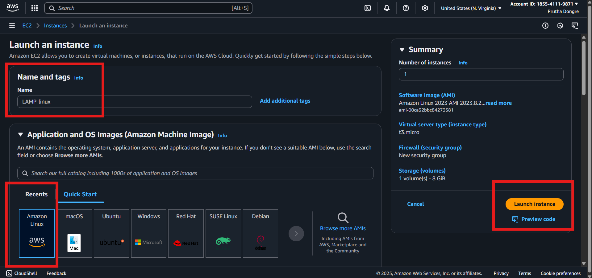

---
### ✔ STEP 2:- Allow Security group: 
  Allow **SSH (22)** and **HTTP (80)** inbound rules
 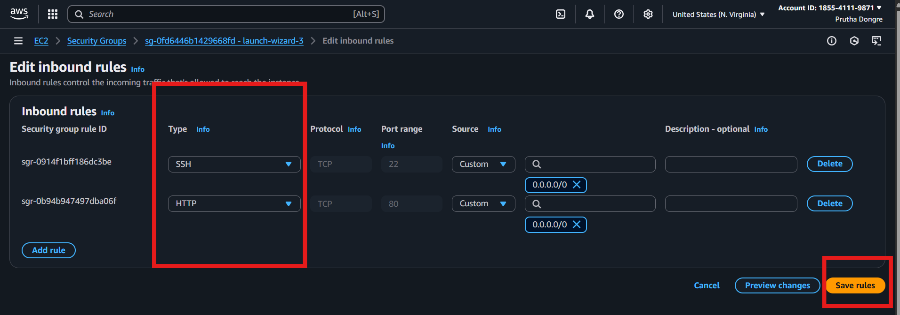

---
### ✔ STEP 3:- Connect to EC2 Instance
```bash
ssh -i "your-key.pem" ec2-user@<your-ec2-public-ip>
```
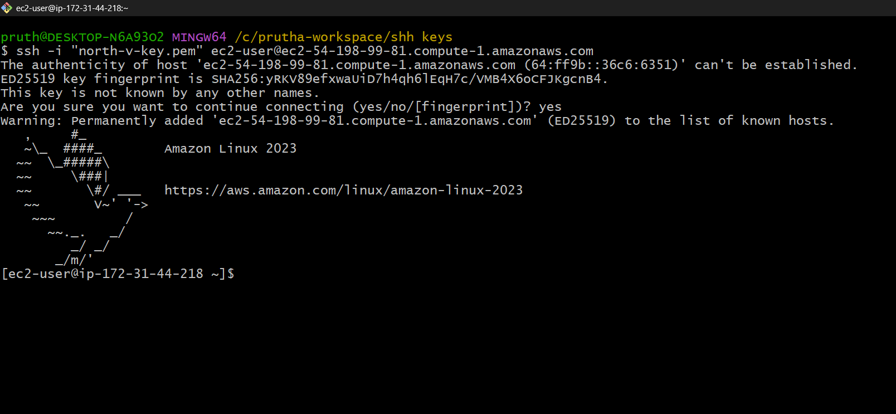

---
### ✔ STEP 4:- Update System Packages
```bash
sudo yum update -y
```
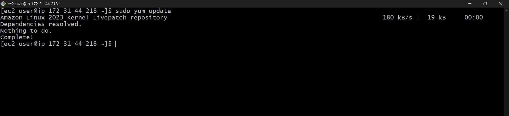

---
### ✔ STEP 5:- Install, start, ebable Apache (httpd) 
```bash
sudo yum install httpd -y
```
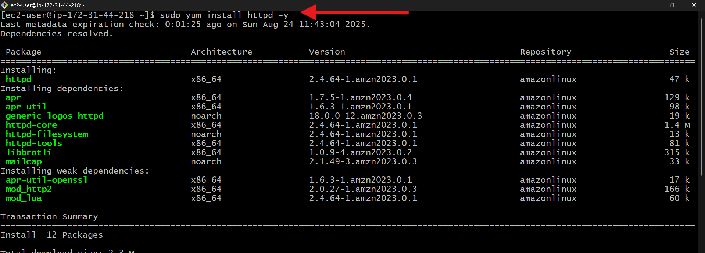


```bash
sudo systemctl start httpd
sudo systemctl enable httpd
```
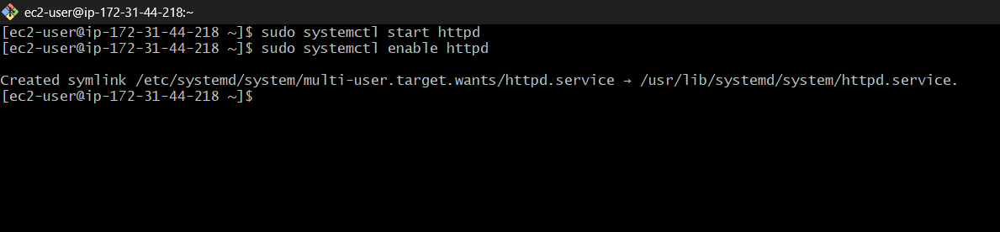


---
### ✔ STEP 6:- Install, start, ebable MariaDB (mysql)
```bash
sudo yum install mariadb105-server -y
```
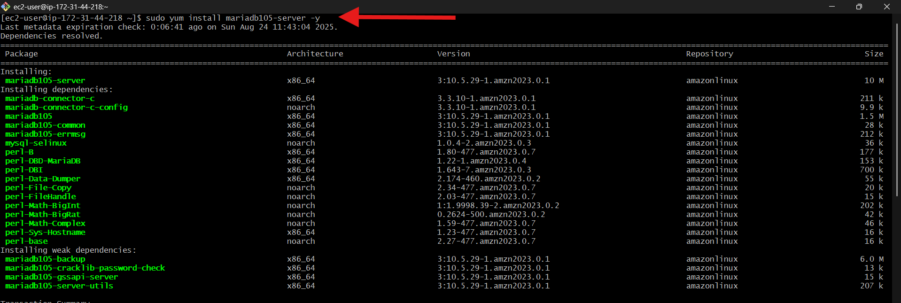

```bash
sudo systemctl start mariadb
sudo systemctl enable mariadb
```
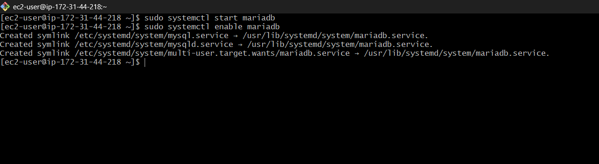

---
### ✔ STEP 7:- Install, start, ebable PHP
```bash
sudo yum install php -y
```
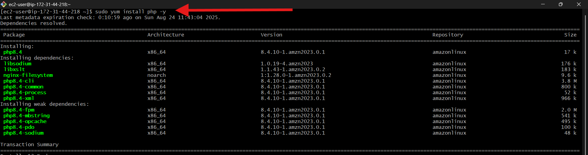

```bash
sudo yum install php8.4-fpm -y
sudo systemctl start php-fpm
sudo systemctl enable php-fpm
```
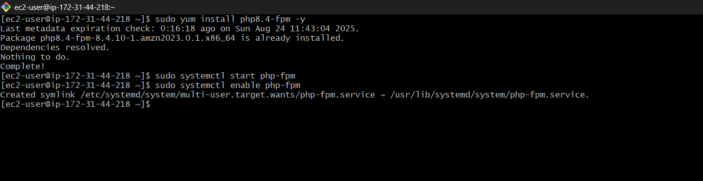
---
### ✔ STEP 8:- Check Service Status
```bash
sudo systemctl status httpd mariadb php-fpm
```
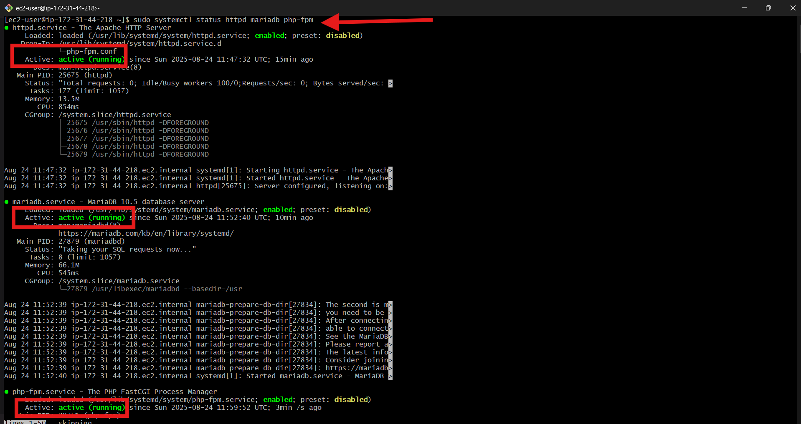

---
### ✔ STEP 9:- Create HTML and PHP Page
- go to default directory
```bash
cd /var/www/html/
```
- create index.html
```bash
sudo vim index.html
```
add
```html
<h1>Hello, LAMP Stack is Working</h1>
```

- create index.php
```bash
sudo vim index.php
```
add
```php
<?php
   phpinfo();
?>
```
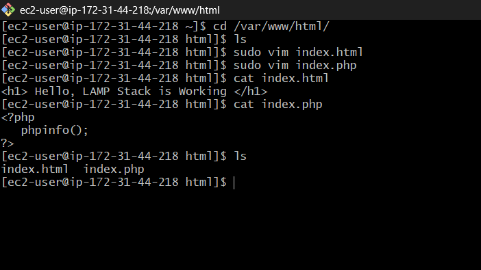

---
### ✔ STEP 10:- Restart Services
```bash
sudo systemctl restart httpd mariadb php-fpm
```
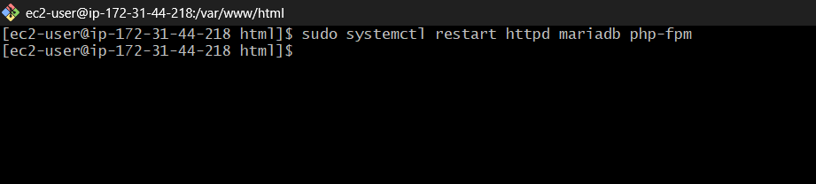

---
### ✔ STEP 11:- Verification
- Open in browser:
  - http://YOUR_SERVER_IP/index.html → HTML works
  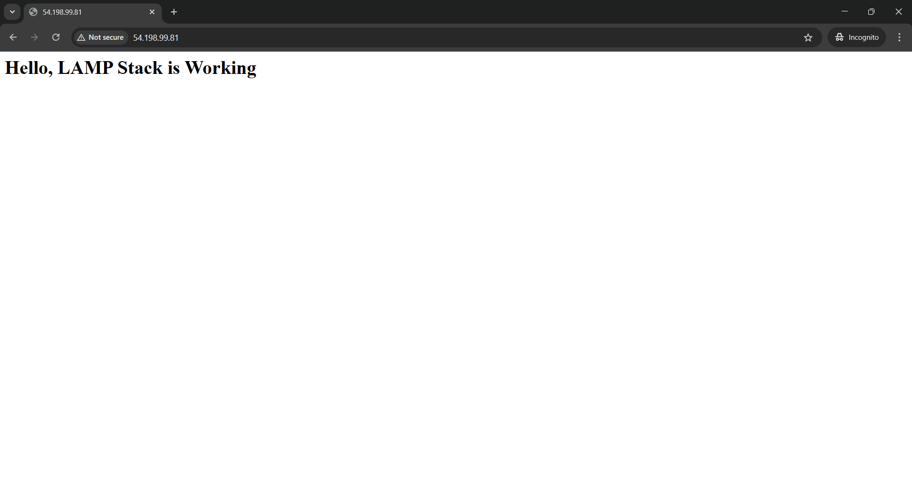
  
  - http://YOUR_SERVER_IP/index.php → PHP info page
  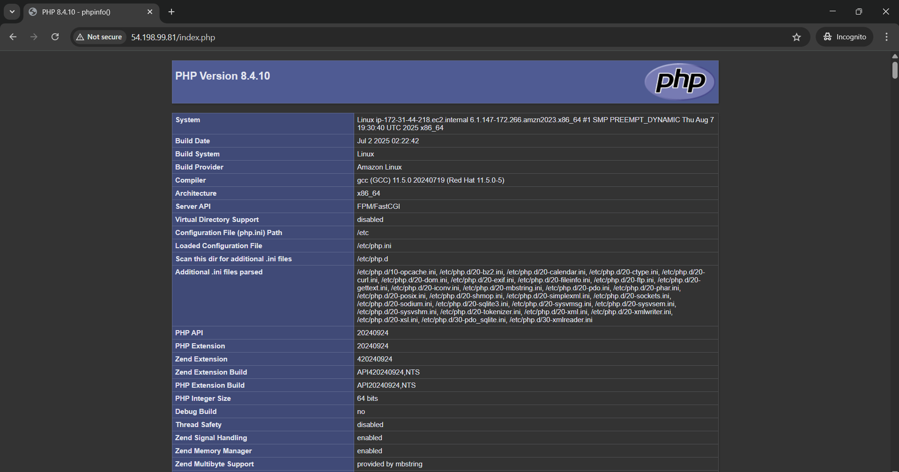

---

## ➤ Summary
This project shows how to deploy a dynamic website on an Amazon Linux EC2 instance using the LAMP stack (Linux, Apache, MariaDB, PHP). It guides you through installing the web server, database, and PHP, creating test pages, and verifying deployment. A simple and practical way to learn full-stack hosting on AWS.
